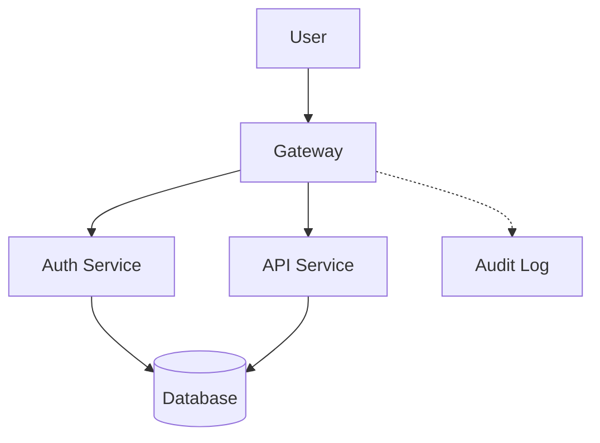
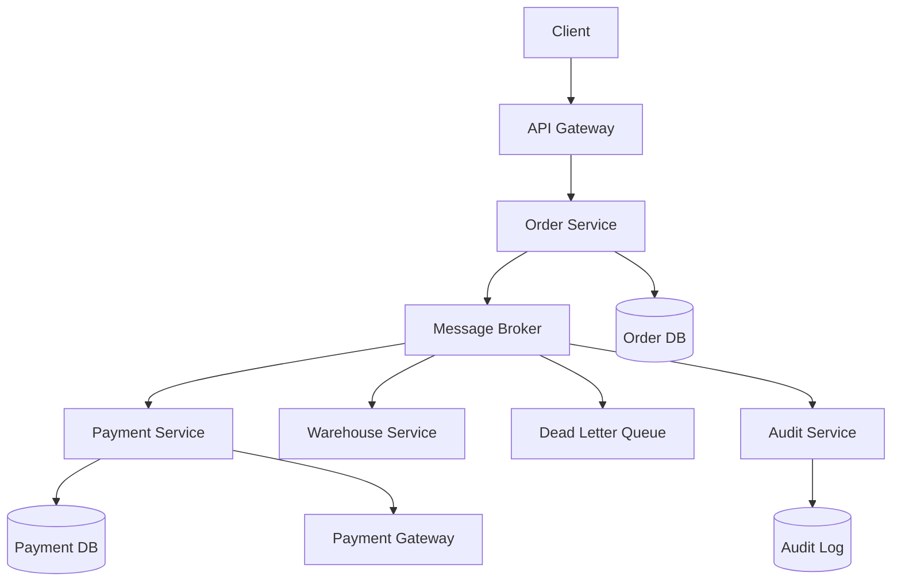
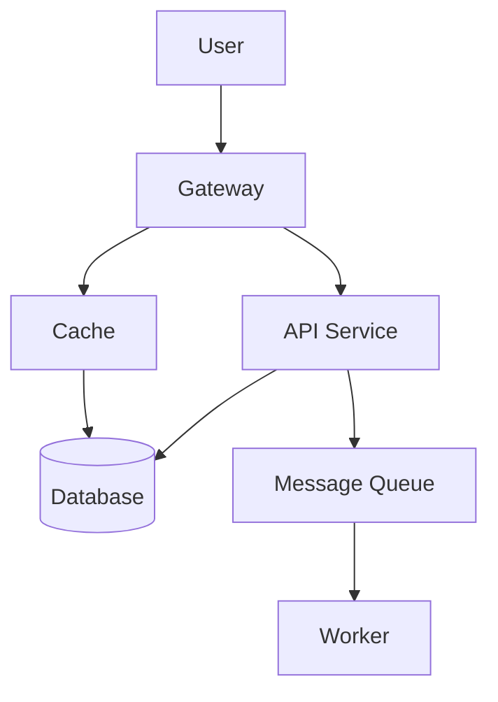

# 🎓 Engineer_GYM - System Practice 트랙

**플랫폼 목표**: 아키텍처 설계 능력 훈련  
**연습 루프**: 시나리오 선택 → 아키텍처 설계 → 자동채점 → AI 피드백 → 개선


---

## 📊 전체 개요

```
┌─────────────────────────────────────────────────┐
│     ENGINEER_GYM SYSTEM PRACTICE PLATFORM      │
│  (자동채점 + 그래프분석 + 피드백 자동화)         │
└─────────────────────────────────────────────────┘
           │
           ├─ 학생 관점
           │  └─ 3개 시나리오 선택
           │     ├─ SYS-RAG-ONPREM-001 온프렘 RAG 문서검색 (권한/보안)
           │     ├─ SYS-ORDER-EVENT-001 주문/결제 이벤트 처리 (일관성/멱등성(결과가 일정하게 잘 나옴))
           │     └─ SYS-REALTIME-NOTIFY-001 실시간 알림/채팅 (성능/규모)
           │
           ├─ 제출 (Mermaid + Tradeoff + 설명)
           │  └─ system_submissions 저장
           │
           ├─ 자동채점 (3 Stage)
           │  ├─ Stage 1: 키워드 기반 채점 (db_03)
           │  ├─ Stage 2: Tradeoff Cap 적용 (db_03)
           │  └─ Stage 3: 그래프 분석 (Python)
           │
           └─ 피드백 (자동 생성)
              ├─ 점수 + Risk Flags
              ├─ 대안 아키텍처 
              └─ 5개 Follow-up 질문 
```

---

## 📁 파일 구조 & 역할

| 파일 | 역할 | 설명 |
|------|------|------|
| **db_01_schema.sql** | 데이터 구조 정의 | 3개 테이블 생성 (scenarios, submissions, results) |
| **db_02_seed_scenarios.sql** | 시나리오 데이터 | 3개 시나리오 + 채점 기준 정의 |
| **db_03_demo_submission_result.sql** | 자동채점 엔진 | 키워드 매칭 + Tradeoff Cap + Risk Flags |
| **review_SPOF_bottleneck.py** | 그래프 분석 | SPOF/병목 탐지 + 대안 + 질문 생성 |
| **.env.example** | 환경변수 템플릿 | DB 연결 정보 |
| **README.md** | 이 파일 | 팀원용 가이드 |

---

```


---

## 📊 3개 시나리오 한눈에 보기

### 1️⃣ **SYS-RAG-ONPREM-001** - 온프렘 RAG 문서검색
- **난이도**: Medium
- **핵심**: 권한(ACL) + 근거(Citation) + 감사로그
- **기술**: RAG, 벡터DB, 권한제어
- **규모**: 사용자 2,000명, QPS 20
- **SLA**: P95 2.5초
- **점수 배분** (가중치 부여 100점 만점):
  - ACL(25) > Audit(20) = Citations(20) > Observability(20) > Failure Mode(15) > Tradeoff(15)

### 2️⃣ **SYS-ORDER-EVENT-001** - 주문/결제 이벤트 처리
- **난이도**: Medium (다른 영역)
- **핵심**: 멱등성(Idempotency) + 정합성(Consistency) + 재시도(Retry)
- **기술**: Event-Driven, Outbox/Saga, DLQ
- **규모**: 사용자 500,000명, QPS 200, 이벤트 800/sec
- **SLA**: P95 1.5초
- **점수 배분**:
  - Idempotency(25) > DLQ/Retry(20) = Outbox/Saga(20) > Observability(15) > ...

### 3️⃣ **SYS-REALTIME-NOTIFY-001** - 실시간 알림/채팅
- **난이도**: Medium (대규모 동시 연결)
- **핵심**: WebSocket + Fanout + 백프레셔(Backpressure)
- **기술**: WebSocket/SSE, Pub/Sub, 폭주제어
- **규모**: 사용자 1,000,000명, 동시접속 50,000명, 메시지 5,000/sec
- **SLA**: P95 800ms
- **점수 배분**:
  - WebSocket Gateway(20) = Fanout Broker(20) = Backpressure(20) > ACK/Retry(15) > ...

---

## 🎯 채점 시스템 (3 Stage)

### Stage 1️⃣: 키워드 기반 자동채점 (db_03_demo_submission_result.sql)

**목적**: Mermaid + Components 텍스트에서 자동으로 점수 계산

**방식**: 정규식(REGEXP)으로 키워드 검색

```sql
-- 예시
IF mermaid REGEXP 'acl|auth|role|permission' OR components REGEXP '...'
  THEN score_acl = 25
  ELSE score_acl = 0
END

IF mermaid REGEXP 'audit|log' OR components REGEXP '...'
  THEN score_audit = 20
  ELSE score_audit = 0
END

-- 모든 항목 합산
raw_total = 10(기본) + score_acl + score_audit + ... + score_tradeoff
```

**검색 키워드** (checklist_template.keyword_hints):
```json
{
  "acl": "acl|auth|role|permission",
  "audit_log": "audit|log",
  "citations": "citation|reference|출처",
  "idempotency": "idempot|dedup|중복",
  "dlq_retry": "dlq|dead letter|retry|backoff|재시도",
  "outbox_saga": "outbox|cdc|saga|compens|보상"
}
```

### Stage 2️⃣: Tradeoff Cap 적용 (db_03_demo_submission_result.sql)

**목적**: Tradeoff 부족분을 만점 상한선(Cap)으로 강제

**규칙**:
```
Tradeoff 3개 이상 → Cap 100 (만점 가능)
Tradeoff 2개     → Cap 85  (85점 이상 불가)
Tradeoff 1개     → Cap 70  (70점 이상 불가)
Tradeoff 0개     → Cap 60  (60점 이상 불가)
```

**계산**:
```
Raw Total = 10 + 각 항목 점수
Final Score = MIN(Raw Total, Cap)

예) Raw 88점, Tradeoff 2개
    Final = MIN(88, 85) = 85점 (Cap 적용!)
```

### Stage 3️⃣: 그래프 분석 (review_SPOF_bottleneck.py)

**목적**: Mermaid 다이어그램을 그래프로 변환하여 아키텍처 약점 탐지

**세부 단계**:

```python
# Step 1: Mermaid 파싱
edges, labels = parse_mermaid_edges_and_labels(mermaid_text)
# 결과: edges=[(A,B), (B,C), ...], labels={A:"이름", B:"이름"}

# Step 2: 네트워크 그래프 생성
G = nx.DiGraph()
G.add_edges_from(edges)

# Step 3: Entry/Exit 결정
entry, exits = choose_entry_exit(G, labels, entry_hint, exit_hint)
# 힌트: %% entry: User, %% exit: DB

# Step 4: 핵심 경로만 추출 (노이즈 제거)
core = core_subgraph_nodes(G, entry, exits)

# Step 5: SPOF 탐지 ⚠️
spofs = compute_spof(G, entry, exits, core, redundant)
# 알고리즘: Articulation Points (단절점)

# Step 6: 병목 탐지
bottlenecks = compute_bottlenecks(G, core, labels, topk=3)
# 알고리즘: Betweenness Centrality + Fan-in/out

# Step 7: 대안 아키텍처 생성 ✨
alternative_arch = generate_alternative_architecture(spofs, bottlenecks, labels, G)

# Step 8: 동적 질문 생성 ✨
questions = generate_followup_questions(submission, graph_analysis, penalty_info)

# Step 9: 감점 계산
spof_penalty = len(spofs) * 12 (최대 36)
bottleneck_penalty = len(bottlenecks) * 6 (최대 18)
total_penalty = spof_penalty + bottleneck_penalty

# Step 10: system_results 업데이트
new_score = stage2_score - total_penalty
```

---

## 📈 점수 계산 예시

### 제출 내용
```
시나리오: SYS-RAG-ONPREM-001
제출:
  - Mermaid: "... gateway ... acl ... audit ... observable ..."
  - Components: "Gateway는 인증을 담당합니다. Audit Log를..."
  - Tradeoff: 2개 (ACL, Cache)
  - Observability: "p95 latency, error rate, trace id"
```

### Stage 1 채점
```
기본: 10점
ACL: 25점 (✅ 'acl' 찾음)
Audit: 20점 (✅ 'audit' 찾음)
Observability: 25점 (✅ 3개 키워드)
Failure Mode: 0점 (❌ 없음)
Tradeoff: 8점 (2개)

Raw Total = 88점
```

### Stage 2 Cap 적용
```
Tradeoff 2개 → Cap 85

Final Score = MIN(88, 85) = 85점 ✅

Risk Flags:
  - "INSUFFICIENT_TRADEOFFS"
  - "CAP_APPLIED_BY_TRADEOFFS"
```

### Stage 3 그래프 분석
```
Mermaid 파싱:
  Nodes: Gateway, ACL, VectorDB, AuditLog
  Edges: (Gateway → ACL), (ACL → VectorDB), (Gateway → AuditLog)

SPOF 탐지:
  → Gateway가 단절점 (모든 경로 지남)
  → Penalty: -12점

병목 탐지:
  → VectorDB fan-in 높음
  → Penalty: -6점

총 감점: -18점

최종 점수 = 85 - 18 = 67점
```

---

## 🎓 Mermaid 작성 가이드

### 기본 문법



### 주석 힌트 사용 (정확도 향상)

```
%% entry: [노드ID]          → 시작점 명시
%% exit: [노드ID]           → 종착점 명시
%% redundant: [노드A],[노드B] → 이중화 노드 명시
```

**효과**:
- SPOF 탐지 정확도 ↑
- 불필요한 감점 방지
- 그래프 분석 자동화

### 실전 예시 (SYS-ORDER-EVENT-001)



---

## 🔧 운영 & 확장

### 새 시나리오 추가

```sql
INSERT INTO system_scenarios (
  id, track, title, difficulty, tags, version,
  context_json, requirements_json, constraints_json, traffic_json,
  submission_format_json, checklist_template_json, admin_notes_json
) VALUES (
  'SYS-[새시나리오]-001',
  'system_practice',
  '제목',
  'medium',
  JSON_ARRAY('태그1', '태그2'),
  '1.0.0',
  JSON_OBJECT('background','...', 'goal','...', 'environment','...'),
  JSON_ARRAY('요구사항1', '요구사항2'),
  JSON_ARRAY('제약1', '제약2'),
  JSON_OBJECT('users_total', 1000, 'qps_peak', 100, 'sla_p95_latency_ms', 2000),
  JSON_OBJECT('required_artifacts', JSON_ARRAY('Mermaid', 'Tradeoffs')),
  JSON_OBJECT(
    'scoring', JSON_OBJECT(
      'weights', JSON_OBJECT('항목1', 25, '항목2', 20),
      'keyword_hints', JSON_OBJECT('항목1', 'keyword1|keyword2')
    )
  ),
  JSON_OBJECT('recommended_min_components', JSON_ARRAY('...'))
);
```

### 감점 정책 조정

```python
# review_SPOF_bottleneck.py 수정
SPOF_PENALTY_PER = 12        # SPOF 1개당 감점
SPOF_PENALTY_CAP = 36        # SPOF 감점 최대치
BOTTLENECK_PENALTY_PER = 6   # 병목 1개당 감점
BOTTLENECK_PENALTY_CAP = 18  # 병목 감점 최대치
```

### Keyword Hints 추가

```json
"keyword_hints": {
  "새항목": "keyword1|keyword2|keyword3",
  "새항목2": "keyword4|keyword5"
}
```

자동채점 스크립트가 자동으로 인식합니다.

---

## 🔍 트러블슈팅

### Q1: "DB 연결 실패"
```
해결: .env 파일 확인
- DB_HOST가 localhost인가?
- DB_USER와 DB_PASSWORD가 맞는가?

테스트:
mysql -u root -p -e "SELECT 1"
```

### Q2: "Mermaid 파싱 오류"
```
확인사항:
✅ 화살표는 --> 또는 -> 사용
✅ 노드는 [텍스트] 형태
✅ semicolon으로 구분

❌ 잘못된 예
User -> API -> DB

✅ 올바른 예
User[User] --> API[API] --> DB[(DB)]
```

### Q3: "예상과 다른 점수"
```
확인:
1. score_breakdown_json에서 raw_total 확인
2. Tradeoff 개수 확인
3. Cap 값 확인
4. graph_penalty 확인

예:
Raw 88 + Cap 85 = Final 85 (Cap 적용됨!)
Stage 3 감점 -12 = 최종 73점
```

---

## 📚 상세 문서

더 깊이 있는 이해를 원하면:
- **CODE_EXPLANATION.md**: 모든 코드 상세 설명
- **SEED_SCENARIOS_DETAILED.md**: 3개 시나리오 완전 분석

---

## 🎯 주요 특징

| 특징 | 설명 |
|------|------|
| ✅ **자동채점** | 키워드 기반 (정확도 높음) |
| ✅ **Tradeoff Cap** | 완전성 강제 (최소 3개 필수) |
| ✅ **SPOF 탐지** | 그래프 이론 (단절점 알고리즘) |
| ✅ **병목 탐지** | 중앙성 + 팬인/아웃 |
| ✅ **대안 제시** | 자동 생성 ✨ |
| ✅ **질문 생성** | 동적 면접관 질문 ✨ |
| ✅ **환경변수** | 보안 강화 (.env 사용) |
| ✅ **에러 처리** | 상세 로그 + 복구 가능 |

---

## 🚀 다음 Phase (2025년)

### Phase 2: 고도화
- [ ] LLM 기반 AI Coach
- [ ] 실시간 스코어링
- [ ] 더 정교한 Mermaid 파싱 (subgraph, 순환참조)
- [ ] Code Review (실제 코드 분석)

### Phase 3: 게임화
- [ ] 배지/리더보드
- [ ] 캠페인 모드 (여러 시나리오 연결)
- [ ] 멘토링 시스템

---

## 📊 현재 완성도

```
┌─────────────────────────────────┐
│  Engineer_GYM System Practice   │
├─────────────────────────────────┤
│ 시나리오       │ 3개 (완성)     │
│ 자동채점       │ Stage 3 (완성) │
│ SPOF/병목      │ 완성           │
│ 대안 생성      │ ✨ 완성        │
│ 질문 생성      │ ✨ 완성        │
│ 에러 처리      │ ✅ 완성        │
│ 문서화         │ ⭐ 완성        │
├─────────────────────────────────┤
│ 완성도: 85/100 (Phase 1 ✅)    │
└─────────────────────────────────┘
```

---

## 👥 체크리스트 (한 것 / 해야 할 것)

| 역할 | 담당 | 상태 |
|------|------|------|
| **데이터 설계** | DB 스키마 (db_01) | ✅ 완료 |
| **시나리오 설계** | 문제 정의 (db_02) | ✅ 완료 |
| **채점 엔진** | 자동채점 로직 (db_03) | ✅ 완료 |
| **분석 엔진** | 그래프 분석 (Python) | ✅ 완료 |
| **UI/UX** | 학생 인터페이스 | 📅 Phase 2 |
| **AI Coach** | LLM 통합 | 📅 Phase 2 |

---

## 📞 문의

문제가 있으면:
1. 에러 메시지 전체 복사
2. 실행한 명령어 공유
3. DB 데이터 상태 확인

```bash
# 상태 확인
mysql -u root -p Engineer_GYM -e "
  SELECT 
    (SELECT COUNT(*) FROM system_scenarios) AS scenarios,
    (SELECT COUNT(*) FROM system_submissions) AS submissions,
    (SELECT COUNT(*) FROM system_results) AS results;
"
```

---

**Created**: 2025-01-15  
**Version**: v1.0 (Phase 1 완료)  
**Made with ❤️ for System Practice 교육 플랫폼**

---

## 📊 시나리오 3개

### 1️⃣ **SYS-RAG-ONPREM-001** (중급)
- **주제**: 온프렘 사내 문서 검색 RAG 챗봇
- **핵심 이슈**:
  - 🔐 ACL(권한) 준수
  - 🔍 의미론적 검색 (Semantic Search)
  - 📝 감사로그 (Audit Trail)
  - 🚫 외부 API 호출 불가 (온프렘)
- **평가 항목**: ACL(25), Audit(20), Observability(25), Failure Mode(20), Tradeoff(15)

### 2️⃣ **SYS-ORDER-EVENT-001** (어려움)
- **주제**: 피크 트래픽 주문/결제 이벤트 처리
- **핵심 이슈**:
  - 💳 중복 결제 방지 (Idempotency)
  - ⚡ 이벤트 일관성 (Outbox/Saga)
  - 🚨 장애 격리 (DLQ)
  - 📊 관측성 (Trace/Metric)
  - 📋 감사로그 (정산 추적)
- **평가 항목**: Idempotency(25), Failure Mode(20), Observability(20), Audit(15), Data Consistency(20)

### 3️⃣ **SYS-REALTIME-NOTIFY-001** (중급)
- **주제**: 실시간 알림/채팅 (WebSocket)
- **핵심 이슈**:
  - 🔐 채널별 권한
  - 📈 대규모 팬아웃 (Fanout)
  - 📨 메시지 유실 방지
  - 🔄 재연결 대응 (Backpressure)
  - 📊 관측성
- **평가 항목**: Auth/ACL(20), SPOF/병목(25), Observability(20), Failure Mode(20), Rate Limit(15)

---

## 🎯 채점 시스템

### 룰 기반 자동채점 (db_03_demo_submission_result.sql)

#### 1️⃣ **Tradeoff 상한선(Cap) 규칙** ✅
```
제출된 Tradeoff 개수:
- 3개 이상 → 만점 100 가능
- 2개     → 만점 상한 85 (부족함을 표현)
- 1개     → 만점 상한 70 (심각히 부족)
- 0개     → 만점 상한 60 (거의 없음)
```

#### 2️⃣ **키워드 기반 항목 점수**
```
ACL/권한        → +25점 (키워드: acl, auth, role, permission)
Audit/Log       → +20점 (키워드: audit, log)
Observability   → +25점 (3개 이상 키워드: p95, error, trace, metric, alert)
Failure Mode    → +20점 (키워드: down, fail, fallback, degrade, 장애)
Tradeoff 개수   → +3~15점 (0개=0, 1개=3, 2개=8, 3개+=15)
기본점          → +10점
```

**예시 계산:**
```
Raw Total = 10 + 25(ACL) + 20(Audit) + 25(Obs) + 20(FM) + 8(2개 Tradeoff) = 108

Tradeoff 2개 → Cap 85 적용

Final Score = MIN(85, 108) = 85점
```

---

## 🔴 SPOF/병목 자동 탐지 (review_SPOF_bottleneck.py v3)

### 1️⃣ **SPOF (Single Point of Failure) 탐지**

**알고리즘**: 그래프 이론의 **단절점(Articulation Points)** 활용

```
Entry → 모든 Exits에 도달하는 경로 중
하나의 노드만 제거되면 연결이 끊기는 경우 = SPOF
```

**예시**:
```
User → LB → API → DB → Response
         ↑
        SPOF: API (유일한 경로)
```

**감점 정책**:
```
SPOF 1개당 -12점, 최대 -36점 (3개 이상)
```

### 2️⃣ **병목(Bottleneck) 탐지**

**알고리즘**: **중앙성(Betweenness Centrality)** + **팬인/팬아웃**

```
점수 = Betweenness + 0.06×Fan-in + 0.02×Fan-out + 보너스(Stateful)

Stateful 컴포넌트(DB/Redis/Queue) → +0.20 보너스
```

**예시**:
```
Client → Gateway → Service → DB ← Service
         중앙성 높음 = 모든 요청이 이곳을 지남
```

**감점 정책**:
```
병목 1개당 -6점, 최대 -18점 (3개 이상)
```

### 3️⃣ **💡 대안 아키텍처 자동 제시** (v3 신기능)

SPOF/병목을 해결하는 구체적 방안을 자동으로 제시합니다:

```
✓ [Gateway 이중화] 로드밸런서 2대 이상 배치, Active-Active 구성
✓ [API 비동기화] 무거운 작업을 Queue에 오프로드, 백그라운드 워커로 처리
✓ [DB 캐싱] 자주 읽는 데이터를 Redis로 캐싱, TTL 정책 관리
✓ [DB 샤딩] 핫 데이터 기준으로 샤딩, 범위/해시 파티셔닝
```

### 4️⃣ **❓ Follow-up 질문 자동 생성** (v3 신기능)

시니어 면접관처럼 5개 질문을 자동 생성:

```
1. 'Gateway' 컴포넌트가 장애 시, 어떻게 전체 서비스를 보호할 건가요?
2. 'DB' 노드의 처리량(throughput)이 P99에서 폭증하면?
3. 'ACL' 트레이드오프에서 '복잡도 증가'를 어떻게 완화할 건가요?
4. 이 설계에서 가장 취약한 부분(Single Point of Concern)은 어디인가요?
5. 팀 규모(SRE 몇 명)가 운영 가능할 것 같나요?
```

---

## 🔧 Mermaid 입력 가이드

### 기본 문법



### 주석 힌트 활용 (정확도 향상)

| 힌트 | 예시 | 효과 |
|------|------|------|
| `%% entry:` | `%% entry: User` | Entry 노드 명시 |
| `%% exit:` | `%% exit: DB` | Exit 노드 명시 |
| `%% redundant:` | `%% redundant: LB1,LB2` | 이중화된 노드 (SPOF 후보 제외) |

---

## 📈 점수 계산 상세 예시

### 제출 1건 분석

```sql
-- mermaid_text
graph TD
    Client[User] --> LB[Load Balancer]
    LB --> API[API Gateway]
    API --> Service[Order Service]
    Service --> DB[(Main DB)]
    Service --> Cache[Redis Cache]
    Service --> Queue[Kafka]
    Queue --> Worker[Order Worker]

-- tradeoffs_json (2개만)
[
  {"topic": "Idempotency", "pros": "중복 결제 방지", "cons": "복잡도 증가"},
  {"topic": "Cache", "pros": "지연 감소", "cons": "불일치 위험"}
]

-- observability 키워드
"p95 latency, error rate, trace id로 모니터링"
```

### 채점 결과

| 항목 | 점수 | 설명 |
|------|------|------|
| 기본 | 10점 | 고정 |
| Tradeoff (2개) | 8점 | 개수별 점수 |
| Idempotency (미검색) | 0점 | 키워드 부재 |
| Failure Mode (미검색) | 0점 | 키워드 부재 |
| Observability (3개 키워드) | 25점 | 임계값 충족 |
| **Raw Total** | **43점** | |
| **Cap (Tradeoff 2개)** | **85점** | |
| **Final Score** | **43점** | Raw Total < Cap → 그대로 |
| **SPOF 감점** | -12점 | API Gateway SPOF 1개 |
| **최종 점수** | **31점** | 43 - 12 = 31 |

---

## 🛠️ 운영 시나리오

### 사용자 제출 → 채점 → Feedback 흐름

```
1️⃣ 사용자가 Scenario에서 요구사항 확인
   └─ SYS-ORDER-EVENT-001: 피크 트래픽 주문/결제
   
2️⃣ Mermaid 다이어그램 + 컴포넌트 설명 + Tradeoff 3개 제출
   └─ system_submissions 테이블에 INSERT

3️⃣ 자동채점 스크립트 실행
   db_03_demo_submission_result.sql:
   └─ 키워드 매칭으로 항목별 점수 계산
   └─ Tradeoff Cap 적용
   └─ risk_flags 설정
   
4️⃣ 그래프 분석 실행
   python review_SPOF_bottleneck.py:
   └─ Mermaid 파싱 → 그래프 생성
   └─ SPOF 탐지 (단절점 알고리즘)
   └─ 병목 탐지 (중앙성 + 팬인)
   └─ 대안 아키텍처 생성
   └─ Follow-up 질문 생성
   └─ 감점 반영 + system_results 업데이트

5️⃣ 피드백 제공
   system_results에서 조회:
   ├─ score_total: 최종 점수
   ├─ score_breakdown_json: 항목별 점수 + SPOF/병목 분석
   ├─ risk_flags_json: [SPOF_DETECTED, INSUFFICIENT_TRADEOFFS, ...]
   ├─ alternative_mermaid_text: 개선된 아키텍처 제안 텍스트
   ├─ questions_json: 5개 Follow-up 질문
   └─ coach_summary: 종합 피드백
```

---

## ⚙️ 환경 설정

### .env 파일 작성

```bash
cp .env.example .env
```

```ini
# .env
DB_HOST=localhost
DB_USER=root
DB_PASSWORD=your_mysql_password
DB_PORT=3306
DB_NAME=Engineer_GYM

LOG_LEVEL=INFO

SPOF_PENALTY_PER=12
SPOF_PENALTY_CAP=36
BOTTLENECK_PENALTY_PER=6
BOTTLENECK_PENALTY_CAP=18
```

### 보안 주의

⚠️ **`.env` 파일을 Git에 커밋하지 마세요!**

```bash
# .gitignore에 추가
echo ".env" >> .gitignore
```

---

## 🐛 트러블슈팅

### Q1: DB 연결 실패
```
❌ DB 연결 실패: Access denied for user 'root'@'localhost'
```

**해결**:
```bash
# 1. MySQL 서버 실행 확인
mysql -u root -p -e "SELECT 1"

# 2. .env 파일의 비밀번호 확인
cat .env | grep DB_PASSWORD
```

### Q2: Mermaid 파싱 오류
```
⚠️  경고: 파싱된 엣지가 없습니다. Mermaid 형식을 확인하세요.
```

**해결**:
```mermaid
❌ 잘못된 형식:
User -> API -> DB

✅ 올바른 형식:
User[User] --> API[API] --> DB[(DB)]
```

### Q3: 감점이 예상과 다름
```
score_breakdown_json에서 meta.graph_penalty 확인
└─ spof_count, bottleneck_count, penalty 값 검증
```

---

## 📚 다음 단계 (Phase 2)

### v4 계획 (2025년)

- [ ] **AI Coach** (LLM 기반 맞춤 피드백)
- [ ] **Mermaid 상세 검증** (subgraph, 순환참조, 레이턴시 표기)
- [ ] **실시간 스코어링** (제출 즉시 피드백)
- [ ] **게임화** (점수/배지/리더보드)
- [ ] **Code Review** (실제 코드 제출 분석)

---

## 🎓 학습 목표

| 항목 | 목표 |
|------|------|
| **그림 = 사고방식** | Mermaid로 아키텍처를 논리적으로 시각화 |
| **SPOF 감각** | 단절점을 찾아 이중화 전략 수립 |
| **병목 인지** | 트래픽이 몰리는 지점을 예측하고 최적화 |
| **Tradeoff 설명** | 선택의 장단점을 명확히 언어화 |
| **코칭 수용** | 대안과 질문을 통해 사고 확장 |

---

## 📞 지원

문제가 발생하면 다음을 확인하세요:

1. **DB 테이블 구조** 확인
   ```sql
   SHOW TABLES;
   DESCRIBE system_scenarios;
   ```

2. **최근 제출 데이터** 확인
   ```sql
   SELECT id, user_id, created_at FROM system_submissions ORDER BY id DESC LIMIT 1;
   ```

3. **Python 패키지** 확인
   ```bash
   pip list | grep -E "mysql|networkx|python-dotenv"
   ```

---

