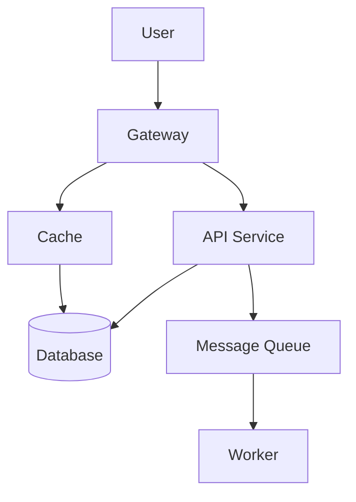

# 🎓 Engineer_GYM - System Practice 트랙

**연습 루프**: Scenario → Submission → 자동채점(SPOF/병목 분석) → Feedback(대안 + 질문)

---

## 📁 파일 구조

```
Engineer_GYM_3.System_Practice/
├── db_01_schema.sql                  # 테이블 생성 (scenario, submission, result)
├── db_02_seed_scenarios.sql          # 3개 시나리오 데이터 + 채점 기준
├── db_03_demo_submission_result.sql  # 제출 1건 + 자동채점 (키워드/Tradeoff cap)
├── review_SPOF_bottleneck.py         # SPOF/병목 탐지 + 대안 생성 + 질문 생성
├── .env.example                      # 환경변수 설정 샘플
└── README.md                         # 이 파일
```

---

## 🚀 빠른 시작

### 1️⃣ 환경 설정

```bash
# Python 패키지 설치
pip install mysql-connector-python networkx python-dotenv

# 환경변수 설정
cp .env.example .env

# .env 파일 편집
# DB_HOST, DB_USER, DB_PASSWORD를 본인 환경에 맞게 수정
```

### 2️⃣ 데이터베이스 초기화

```bash
# MySQL에서 실행
mysql -u root -p < db_01_schema.sql
mysql -u root -p < db_02_seed_scenarios.sql
```

### 3️⃣ 데모 실행

```bash
# 제출 샘플 + 자동채점
mysql -u root -p Engineer_GYM < db_03_demo_submission_result.sql

# SPOF/병목 분석 + 대안 + 질문 생성
python review_SPOF_bottleneck.py
```

---

## 📊 시나리오 3개

### 1️⃣ **SYS-RAG-ONPREM-001** (중급)
- **주제**: 온프렘 사내 문서 검색 RAG 챗봇
- **핵심 이슈**:
  - 🔐 ACL(권한) 준수
  - 🔍 의미론적 검색 (Semantic Search)
  - 📝 감사로그 (Audit Trail)
  - 🚫 외부 API 호출 불가 (온프렘)
- **평가 항목**: ACL(25), Audit(20), Observability(25), Failure Mode(20), Tradeoff(15)

### 2️⃣ **SYS-ORDER-EVENT-001** (어려움)
- **주제**: 피크 트래픽 주문/결제 이벤트 처리
- **핵심 이슈**:
  - 💳 중복 결제 방지 (Idempotency)
  - ⚡ 이벤트 일관성 (Outbox/Saga)
  - 🚨 장애 격리 (DLQ)
  - 📊 관측성 (Trace/Metric)
  - 📋 감사로그 (정산 추적)
- **평가 항목**: Idempotency(25), Failure Mode(20), Observability(20), Audit(15), Data Consistency(20)

### 3️⃣ **SYS-REALTIME-NOTIFY-001** (중급)
- **주제**: 실시간 알림/채팅 (WebSocket)
- **핵심 이슈**:
  - 🔐 채널별 권한
  - 📈 대규모 팬아웃 (Fanout)
  - 📨 메시지 유실 방지
  - 🔄 재연결 대응 (Backpressure)
  - 📊 관측성
- **평가 항목**: Auth/ACL(20), SPOF/병목(25), Observability(20), Failure Mode(20), Rate Limit(15)

---

## 🎯 채점 시스템

### 룰 기반 자동채점 (db_03_demo_submission_result.sql)

#### 1️⃣ **Tradeoff 상한선(Cap) 규칙** ✅
```
제출된 Tradeoff 개수:
- 3개 이상 → 만점 100 가능
- 2개     → 만점 상한 85 (부족함을 표현)
- 1개     → 만점 상한 70 (심각히 부족)
- 0개     → 만점 상한 60 (거의 없음)
```

#### 2️⃣ **키워드 기반 항목 점수**
```
ACL/권한        → +25점 (키워드: acl, auth, role, permission)
Audit/Log       → +20점 (키워드: audit, log)
Observability   → +25점 (3개 이상 키워드: p95, error, trace, metric, alert)
Failure Mode    → +20점 (키워드: down, fail, fallback, degrade, 장애)
Tradeoff 개수   → +3~15점 (0개=0, 1개=3, 2개=8, 3개+=15)
기본점          → +10점
```

**예시 계산:**
```
Raw Total = 10 + 25(ACL) + 20(Audit) + 25(Obs) + 20(FM) + 8(2개 Tradeoff) = 108

Tradeoff 2개 → Cap 85 적용

Final Score = MIN(85, 108) = 85점
```

---

## 🔴 SPOF/병목 자동 탐지 (review_SPOF_bottleneck.py v3)

### 1️⃣ **SPOF (Single Point of Failure) 탐지**

**알고리즘**: 그래프 이론의 **단절점(Articulation Points)** 활용

```
Entry → 모든 Exits에 도달하는 경로 중
하나의 노드만 제거되면 연결이 끊기는 경우 = SPOF
```

**예시**:
```
User → LB → API → DB → Response
         ↑
        SPOF: API (유일한 경로)
```

**감점 정책**:
```
SPOF 1개당 -12점, 최대 -36점 (3개 이상)
```

### 2️⃣ **병목(Bottleneck) 탐지**

**알고리즘**: **중앙성(Betweenness Centrality)** + **팬인/팬아웃**

```
점수 = Betweenness + 0.06×Fan-in + 0.02×Fan-out + 보너스(Stateful)

Stateful 컴포넌트(DB/Redis/Queue) → +0.20 보너스
```

**예시**:
```
Client → Gateway → Service → DB ← Service
         중앙성 높음 = 모든 요청이 이곳을 지남
```

**감점 정책**:
```
병목 1개당 -6점, 최대 -18점 (3개 이상)
```

### 3️⃣ **💡 대안 아키텍처 자동 제시** (v3 신기능)

SPOF/병목을 해결하는 구체적 방안을 자동으로 제시합니다:

```
✓ [Gateway 이중화] 로드밸런서 2대 이상 배치, Active-Active 구성
✓ [API 비동기화] 무거운 작업을 Queue에 오프로드, 백그라운드 워커로 처리
✓ [DB 캐싱] 자주 읽는 데이터를 Redis로 캐싱, TTL 정책 관리
✓ [DB 샤딩] 핫 데이터 기준으로 샤딩, 범위/해시 파티셔닝
```

### 4️⃣ **❓ Follow-up 질문 자동 생성** (v3 신기능)

시니어 면접관처럼 5개 질문을 자동 생성:

```
1. 'Gateway' 컴포넌트가 장애 시, 어떻게 전체 서비스를 보호할 건가요?
2. 'DB' 노드의 처리량(throughput)이 P99에서 폭증하면?
3. 'ACL' 트레이드오프에서 '복잡도 증가'를 어떻게 완화할 건가요?
4. 이 설계에서 가장 취약한 부분(Single Point of Concern)은 어디인가요?
5. 팀 규모(SRE 몇 명)가 운영 가능할 것 같나요?
```

---

## 🔧 Mermaid 입력 가이드

### 기본 문법



### 주석 힌트 활용 (정확도 향상)

| 힌트 | 예시 | 효과 |
|------|------|------|
| `%% entry:` | `%% entry: User` | Entry 노드 명시 |
| `%% exit:` | `%% exit: DB` | Exit 노드 명시 |
| `%% redundant:` | `%% redundant: LB1,LB2` | 이중화된 노드 (SPOF 후보 제외) |

---

## 📈 점수 계산 상세 예시

### 제출 1건 분석

```sql
-- mermaid_text
graph TD
    Client[User] --> LB[Load Balancer]
    LB --> API[API Gateway]
    API --> Service[Order Service]
    Service --> DB[(Main DB)]
    Service --> Cache[Redis Cache]
    Service --> Queue[Kafka]
    Queue --> Worker[Order Worker]

-- tradeoffs_json (2개만)
[
  {"topic": "Idempotency", "pros": "중복 결제 방지", "cons": "복잡도 증가"},
  {"topic": "Cache", "pros": "지연 감소", "cons": "불일치 위험"}
]

-- observability 키워드
"p95 latency, error rate, trace id로 모니터링"
```

### 채점 결과

| 항목 | 점수 | 설명 |
|------|------|------|
| 기본 | 10점 | 고정 |
| Tradeoff (2개) | 8점 | 개수별 점수 |
| Idempotency (미검색) | 0점 | 키워드 부재 |
| Failure Mode (미검색) | 0점 | 키워드 부재 |
| Observability (3개 키워드) | 25점 | 임계값 충족 |
| **Raw Total** | **43점** | |
| **Cap (Tradeoff 2개)** | **85점** | |
| **Final Score** | **43점** | Raw Total < Cap → 그대로 |
| **SPOF 감점** | -12점 | API Gateway SPOF 1개 |
| **최종 점수** | **31점** | 43 - 12 = 31 |

---

## 🛠️ 운영 시나리오

### 사용자 제출 → 채점 → Feedback 흐름

```
1️⃣ 사용자가 Scenario에서 요구사항 확인
   └─ SYS-ORDER-EVENT-001: 피크 트래픽 주문/결제
   
2️⃣ Mermaid 다이어그램 + 컴포넌트 설명 + Tradeoff 3개 제출
   └─ system_submissions 테이블에 INSERT

3️⃣ 자동채점 스크립트 실행
   db_03_demo_submission_result.sql:
   └─ 키워드 매칭으로 항목별 점수 계산
   └─ Tradeoff Cap 적용
   └─ risk_flags 설정
   
4️⃣ 그래프 분석 실행
   python review_SPOF_bottleneck.py:
   └─ Mermaid 파싱 → 그래프 생성
   └─ SPOF 탐지 (단절점 알고리즘)
   └─ 병목 탐지 (중앙성 + 팬인)
   └─ 대안 아키텍처 생성
   └─ Follow-up 질문 생성
   └─ 감점 반영 + system_results 업데이트

5️⃣ 피드백 제공
   system_results에서 조회:
   ├─ score_total: 최종 점수
   ├─ score_breakdown_json: 항목별 점수 + SPOF/병목 분석
   ├─ risk_flags_json: [SPOF_DETECTED, INSUFFICIENT_TRADEOFFS, ...]
   ├─ alternative_mermaid_text: 개선된 아키텍처 제안 텍스트
   ├─ questions_json: 5개 Follow-up 질문
   └─ coach_summary: 종합 피드백
```

---

## ⚙️ 환경 설정

### .env 파일 작성

```bash
cp .env.example .env
```

```ini
# .env
DB_HOST=localhost
DB_USER=root
DB_PASSWORD=your_mysql_password
DB_PORT=3306
DB_NAME=Engineer_GYM

LOG_LEVEL=INFO

SPOF_PENALTY_PER=12
SPOF_PENALTY_CAP=36
BOTTLENECK_PENALTY_PER=6
BOTTLENECK_PENALTY_CAP=18
```

### 보안 주의

⚠️ **`.env` 파일을 Git에 커밋하지 마세요!**

```bash
# .gitignore에 추가
echo ".env" >> .gitignore
```

---

## 🐛 트러블슈팅

### Q1: DB 연결 실패
```
❌ DB 연결 실패: Access denied for user 'root'@'localhost'
```

**해결**:
```bash
# 1. MySQL 서버 실행 확인
mysql -u root -p -e "SELECT 1"

# 2. .env 파일의 비밀번호 확인
cat .env | grep DB_PASSWORD
```

### Q2: Mermaid 파싱 오류
```
⚠️  경고: 파싱된 엣지가 없습니다. Mermaid 형식을 확인하세요.
```

**해결**:
```mermaid
❌ 잘못된 형식:
User -> API -> DB

✅ 올바른 형식:
User[User] --> API[API] --> DB[(DB)]
```

### Q3: 감점이 예상과 다름
```
score_breakdown_json에서 meta.graph_penalty 확인
└─ spof_count, bottleneck_count, penalty 값 검증
```

---

## 📚 다음 단계 (Phase 2)

### v4 계획 (2025년)

- [ ] **AI Coach** (LLM 기반 맞춤 피드백)
- [ ] **Mermaid 상세 검증** (subgraph, 순환참조, 레이턴시 표기)
- [ ] **실시간 스코어링** (제출 즉시 피드백)
- [ ] **게임화** (점수/배지/리더보드)
- [ ] **Code Review** (실제 코드 제출 분석)

---

## 🎓 학습 목표

| 항목 | 목표 |
|------|------|
| **그림 = 사고방식** | Mermaid로 아키텍처를 논리적으로 시각화 |
| **SPOF 감각** | 단절점을 찾아 이중화 전략 수립 |
| **병목 인지** | 트래픽이 몰리는 지점을 예측하고 최적화 |
| **Tradeoff 설명** | 선택의 장단점을 명확히 언어화 |
| **코칭 수용** | 대안과 질문을 통해 사고 확장 |

---

## 📞 지원

문제가 발생하면 다음을 확인하세요:

1. **DB 테이블 구조** 확인
   ```sql
   SHOW TABLES;
   DESCRIBE system_scenarios;
   ```

2. **최근 제출 데이터** 확인
   ```sql
   SELECT id, user_id, created_at FROM system_submissions ORDER BY id DESC LIMIT 1;
   ```

3. **Python 패키지** 확인
   ```bash
   pip list | grep -E "mysql|networkx|python-dotenv"
   ```

---

**Made with ❤️ for System Practice**  
**Last Updated**: 2026-01-15  
**Version**: v3 (SPOF/병목 + 대안 + 질문)
