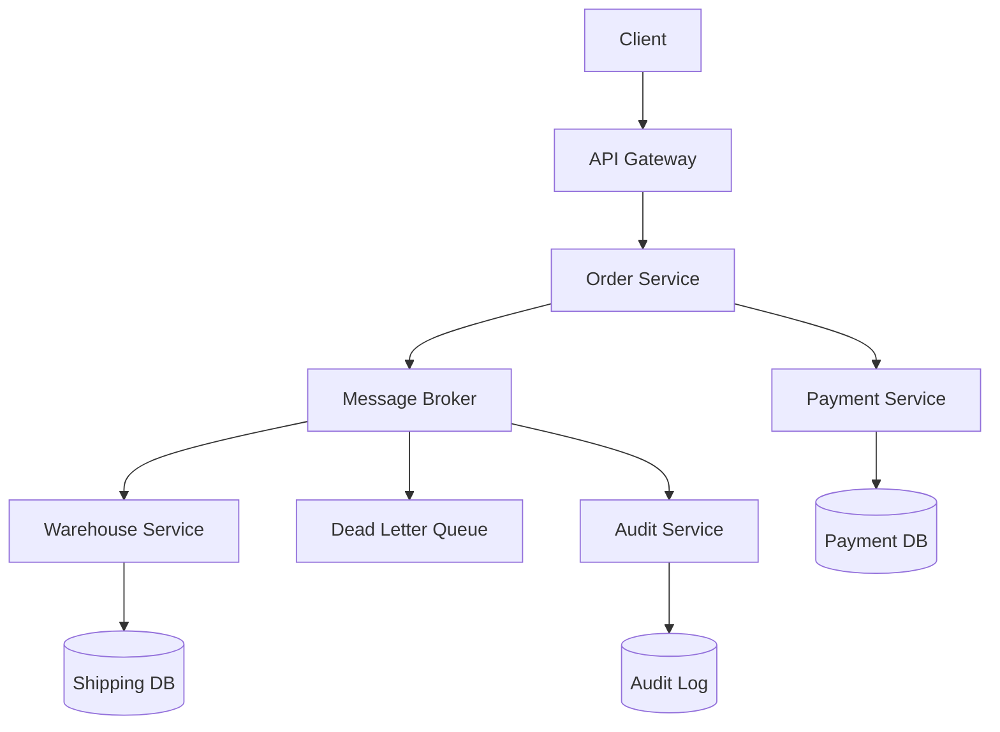
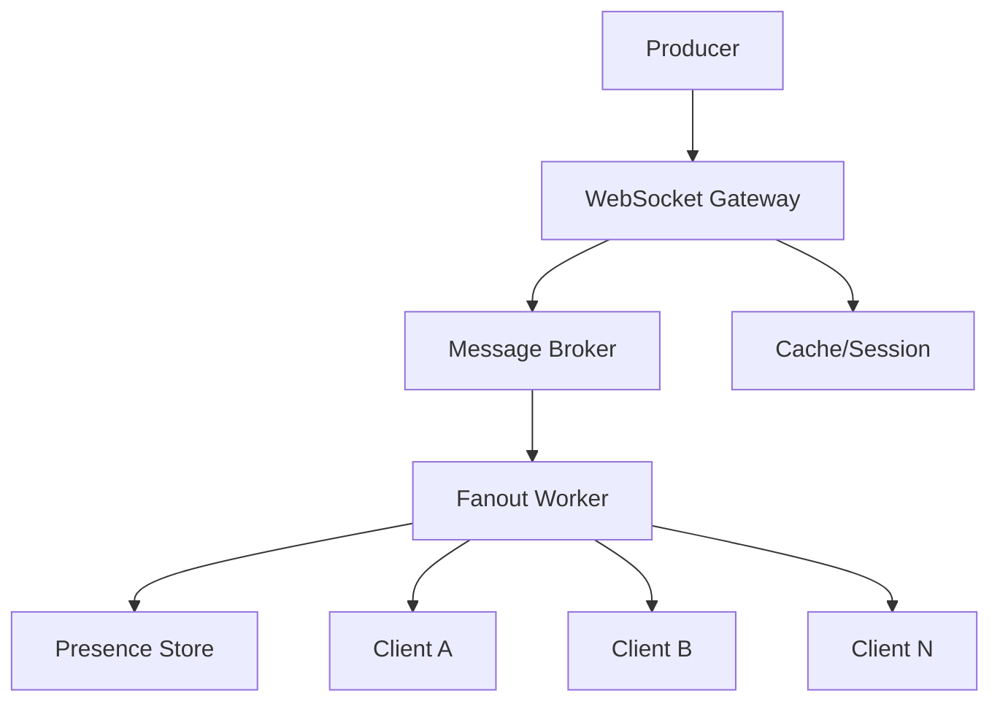
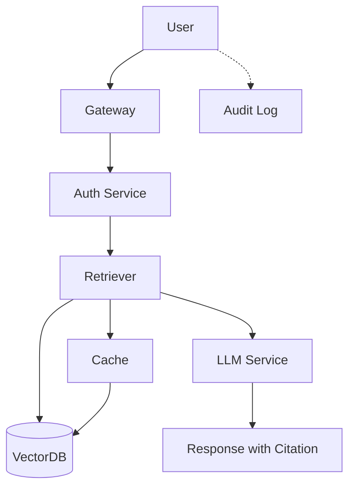

# 🎯 db_02_seed_scenarios.sql 상세 설명

**목적**: 3개의 실전 시나리오를 DB에 저장 → 학생들이 선택해서 풀기

---

## 📐 구조 개요

```
INSERT INTO system_scenarios (
  id,                      -- 시나리오 고유 ID
  track,                   -- 'system_practice'
  title,                   -- 사람이 읽을 제목
  difficulty,              -- 'medium' / 'hard'
  tags,                    -- 검색용 태그 배열
  version,                 -- '1.0.0'
  
  ---- 📖 학생이 읽는 것 ----
  context_json,            -- 배경/목표/환경
  requirements_json,       -- 해야 할 것 (필수)
  constraints_json,        -- 제약사항 (어려움)
  traffic_json,            -- 트래픽/SLA 스펙
  
  ---- 📋 제출 & 채점 ----
  submission_format_json,  -- 뭘 제출할지
  checklist_template_json, -- 점수표
  admin_notes_json         -- 채점자 가이드
) VALUES (...)
```

---

## 🎓 시나리오 1️⃣ - SYS-RAG-ONPREM-001 (중급)

### 핵심 정보
```
ID:         SYS-RAG-ONPREM-001
Title:      온프렘 사내 문서 검색 RAG 챗봇(권한/근거/감사로그)
Difficulty: medium
Tags:       RAG, On-Prem, ACL, Observability
```

### 📖 학생을 위한 시나리오 (context_json)

```json
{
  "background": "사내 문서(규정/기술문서/회의록)를 검색+요약해주는 RAG 챗봇이 필요합니다.",
  "goal": "권한(ACL)을 지키면서 근거(citation)와 감사로그(audit log)가 남는 검색/응답 시스템 설계",
  "environment": "On-Prem(망분리), 민감정보 포함 가능"
}
```

**학생이 이해하는 것**:
- 🎯 **무엇**: 사내 문서 검색 챗봇
- 🔐 **제약**: 온프렘(외부망 접근 불가) + 민감정보
- ✅ **목표**: 권한 + 근거 + 감사로그 3가지 모두 구현

### ✅ 필수 요구사항 (requirements_json)

```json
[
  "근거(출처) 첨부",           // RAG는 답변에 "어디서 찾았는지" 명시
  "ACL(권한) 준수",            // 사용자별 접근 범위 제어
  "감사로그 저장",             // 누가, 뭘, 언제 조회했는지 기록
  "관측성(메트릭/트레이싱/알림) 정의"  // 모니터링 전략
]
```

**학생이 제출해야 할 것**:
1. Mermaid에 이 4가지가 모두 표현되어야 함
2. 각각에 대한 설계가 명확해야 함

### ⚠️ 제약사항 (constraints_json)

```json
[
  "온프렘",                    // 외부 API(OpenAI 등) 사용 불가
  "민감정보(PII) 가능",        // 개인정보, 내부 소스코드 등
  "SLA 존재",                 // 지연/가용성 요구사항
  "권한 변경이 발생할 수 있음"  // 동적 ACL 처리
]
```

**이것이 어려운 이유**:
- ❌ 외부 API 못 씀 → LLM을 어디서? (온프렘 LLMOps, 오픈소스)
- ❌ 민감정보 처리 → Prompt Injection, 정보 유출 방지
- ❌ 권한이 자주 바뀜 → 캐시 무효화 전략 필요

### 📊 트래픽 & SLA (traffic_json)

```json
{
  "users_total": 2000,           // 총 사용자 수
  "qps_peak": 20,                // 피크 시 초당 쿼리 20개
  "sla_p95_latency_ms": 2500     // 95% 요청이 2.5초 이내
}
```

**의미**:
- 2000명의 직원이 사용
- 일반적인 시간(피크)에도 초당 20개 쿼리만 들어옴 (상대적으로 낮음)
- P95 지연이 2.5초여야 함 (완화된 SLA)

### 📋 제출 포맷 (submission_format_json)

```json
{
  "required_artifacts": [
    "Mermaid",           // 아키텍처 다이어그램 필수
    "Tradeoffs",         // 3개 이상의 선택과 그 이유
    "FailureMode",       // 장애 시 흐름
    "Observability"      // 모니터링 전략
  ]
}
```

**학생이 제출할 것**:
```
1. Mermaid (필수)
   graph TD
     User[사용자] --> GW[게이트웨이]
     GW --> Auth[인증]
     GW --> Ret[Retriever]
     Ret --> VDB[(벡터DB)]
     Ret --> AuditLog[감사로그]
     ...

2. Tradeoff (최소 3개)
   - ACL: 장점(권한 보호) vs 단점(복잡도) vs 대안(역할 기반)
   - Cache: 장점(빠름) vs 단점(불일치) vs 대안(TTL/invalidation)
   - 임베딩 모델: 장점(정확도) vs 단점(비용/속도) vs 대안(...)

3. Failure Mode
   - 벡터DB 다운 → Fallback?
   - 권한 서비스 느림 → Timeout?

4. Observability
   - 메트릭: p95_latency, citation_rate, acl_check_duration
   - 추적: trace_id로 요청 흐름 추적
   - 알림: P95 > 3초면 alert
```

### 🎓 점수표 (checklist_template_json.scoring.weights)

```json
{
  "weights": {
    "tradeoffs": 15,        // Tradeoff가 충분한가
    "acl": 25,              // ACL이 잘 설계됐나 (가장 중요)
    "audit_log": 20,        // 감사로그가 충분한가
    "citations": 20,        // 근거(citation)가 충분한가
    "observability": 20,    // 모니터링이 충분한가
    "failure_mode": 15      // 장애 대응이 있나
  },
  "notes": "MVP에서는 키워드/룰 기반, 향후 Mermaid 그래프 파싱으로 SPOF/병목 확장"
}
```

**점수 계산**:
```
Raw Total = 기본(10) 
          + ACL 점수(키워드 매칭) 
          + Audit 점수 
          + 기타

총점 = MIN(Raw Total, Cap by Tradeoff)
```

### 💡 채점자 가이드 (admin_notes_json)

```json
{
  "recommended_min_components": [
    "Gateway/Auth",    // 인증/레이트리밋
    "Retriever",       // 벡터 검색 + ACL 필터
    "VectorDB",        // Milvus/Weaviate/Pinecone
    "AuditLog",        // 조회 기록
    "Indexer"          // 문서 색인/임베딩
  ],
  "mermaid_hint": [
    "%% entry: U",              // 입력: 사용자
    "%% exit: Answer",          // 출력: 답변
    "%% redundant: V"           // 이중화: VectorDB
  ]
}
```

**채점자는**:
- 이 컴포넌트들이 Mermaid에 모두 있는지 확인
- `%% entry`, `%% exit`, `%% redundant` 주석으로 정확도 검증

---

## 🎓 시나리오 2️⃣ - SYS-ORDER-EVENT-001 (중급)

### 핵심 정보
```
ID:         SYS-ORDER-EVENT-001
Title:      주문/결제 이벤트 처리(피크 트래픽, 정합성, 재처리)
Difficulty: medium (RAG와 비슷한 난이도이지만 다른 영역)
Tags:       Event-Driven, Payments, Idempotency, DLQ, Outbox
```

### 📖 시나리오 (context_json)

```json
{
  "background": "프로모션 시간에 주문/결제가 급증합니다. 이벤트 기반으로 주문/결제/정산을 처리합니다.",
  "goal": "중복결제/중복처리 방지 + 장애/재시도 시에도 정합성을 지키는 아키텍처 설계",
  "environment": "MSA, 메시지 브로커(Kafka/Rabbit) 사용 가능"
}
```

**핵심 문제**:
- 🎯 **무엇**: 이벤트 기반 주문/결제 처리
- 🔥 **어려움**: 피크 트래픽 + 중복 방지 + 정합성
- ✅ **목표**: 재시도해도 결과가 같아야 함 (멱등성)

### ✅ 필수 요구사항 (requirements_json)

```json
[
  "Idempotency(중복 처리 방지) 전략",           // 같은 요청 2번 = 1번과 같은 결과
  "재시도/백오프 + DLQ(Dead Letter Queue) 처리", // 실패하면?
  "Outbox/CDC 또는 Saga/보상 트랜잭션 중 1개 이상", // 트랜잭션 일관성
  "데이터 정합성(결제 성공/실패 상태 전이) 명확화",  // 상태 관리
  "관측성(지표/알람) 정의"                      // 모니터링
]
```

**학생이 설명해야 할 것**:
```
1. Idempotency 전략
   "결제 요청에 unique key(UUID)를 붙여서,
    같은 key로 2번 요청해도 1번만 처리되도록"

2. DLQ
   "결제 실패 → 일정 시간 후 재시도,
    계속 실패하면 DLQ(Dead Letter Queue)로 이동"

3. Outbox vs Saga
   "Outbox: 결제 완료 → DB에 이벤트 저장 → 별도 프로세스가 꺼냄
    Saga: 결제 → 배송 → 정산을 서비스 간 orchestration"

4. 상태 전이
   pending → processing → success ✓
                       → failed ✗
                       → timeout ⏱️
```

### ⚠️ 제약사항 (constraints_json)

```json
[
  "피크 트래픽(이벤트 폭증)",        // 프로모션 시간에 QPS 급증
  "외부 PG 연동(지연/실패 가능)",   // 신용카드사 API 느릴 수 있음
  "정산/주문 상태는 감사 가능해야 함", // 재무 감사 가능
  "중복 이벤트/순서 뒤바뀜(out-of-order) 발생 가능" // 최소 1회 전달
]
```

**왜 어려운가**:
- 🔥 QPS 200개/초인데, 중복 처리 금지
- 📱 외부 API 지연 → 재시도 필요하지만 중복 안 됨
- 🧮 정산할 때 결제 이력이 명확해야 함

### 📊 트래픽 (traffic_json)

```json
{
  "users_total": 500000,        // 총 사용자 (RAG보다 250배 많음!)
  "qps_peak": 200,              // QPS 200 (RAG는 20)
  "sla_p95_latency_ms": 1500,   // P95 1.5초 (RAG는 2.5초)
  "event_rate_peak_per_sec": 800 // 초당 800개 이벤트 (QPS와 다름)
}
```

**해석**:
- 50만 명 중에 동시에 주문하는 사람들이 QPS 200
- 하지만 결제 → 배송 → 정산 같은 이벤트는 각각 처리되므로 총 800개/초

### 📋 점수표 (checklist_template_json.scoring)

```json
{
  "weights": {
    "tradeoffs": 15,
    "idempotency": 25,          // ⭐ 가장 중요
    "dlq_retry": 20,            // 재시도 전략
    "outbox_saga": 20,          // 트랜잭션 패턴
    "consistency_model": 10,    // 최종 일관성(eventual consistency)
    "observability": 15,
    "failure_mode": 10
  },
  "keyword_hints": {            // ✨ 신기능: 키워드 힌트
    "idempotency": "idempot|dedup|중복",
    "dlq_retry": "dlq|dead letter|retry|backoff|재시도",
    "outbox_saga": "outbox|cdc|saga|compens|보상",
    "consistency": "state|전이|정합|exactly once|at least once"
  }
}
```

**Keyword Hints의 의미**:
- 자동채점 스크립트가 이 키워드들을 찾아서 점수를 부여
- 예) Mermaid에 "idempotency"가 있으면 → idempotency 항목에 25점 자동 부여

### 💡 채점자 가이드 & Mermaid 힌트

```json
{
  "recommended_min_components": [
    "API/Gateway",           // 요청 수신
    "Order Service",         // 주문 생성
    "Payment Service",       // 결제 처리
    "Message Broker",        // 이벤트 발행/구독
    "DLQ",                   // 실패한 이벤트 격리
    "Outbox(or Saga)",       // 트랜잭션 패턴
    "Audit Log"              // 정산 추적
  ],
  "mermaid_hint": [
    "%% entry: Client",      // 입력: 클라이언트 요청
    "%% exit: Settlement",   // 출력: 정산 완료
    "%% redundant: Broker"   // 이중화: 메시지 브로커
  ]
}
```

**예시 Mermaid**:


---

## 🎓 시나리오 3️⃣ - SYS-REALTIME-NOTIFY-001 (중급)

### 핵심 정보
```
ID:         SYS-REALTIME-NOTIFY-001
Title:      실시간 알림/채팅(웹소켓, Fanout, Backpressure)
Difficulty: medium
Tags:       Realtime, WebSocket, Fanout, PubSub, Backpressure
```

### 📖 시나리오 (context_json)

```json
{
  "background": "사용자에게 실시간 알림/채팅을 제공합니다. 연결 수가 많고 특정 시간에 메시지 폭증이 발생합니다.",
  "goal": "실시간 연결(WebSocket) + 메시지 fanout + 폭주(backpressure) 제어 + 유실 방지 설계",
  "environment": "클라우드/온프렘 무관, Pub/Sub 가능"
}
```

**핵심**:
- 🎯 **무엇**: 실시간 알림/채팅 (유튜브 라이브 채팅 같은)
- 🔥 **어려움**: 동시접속 50000명, 메시지 폭증, 폭주 제어
- ✅ **목표**: 메시지 유실 없이 모든 클라이언트에게 전달

### ✅ 필수 요구사항 (requirements_json)

```json
[
  "WebSocket(또는 SSE) 게이트웨이 설계",        // 실시간 연결
  "Fanout(브로커/채널) 설계",                  // 메시지 브로드캐스트
  "Backpressure/Rate limit/Buffer 전략",      // 폭주 제어
  "ACK/재전송/유실 방지(최소 1개) 언급",        // 신뢰성
  "관측성(연결수, 메시지 지연, 드롭률) 정의"   // 모니터링
]
```

**학생이 설명해야 할 것**:
```
1. WebSocket Gateway
   "Nginx + Node.js로 50000개 동시 접속 처리"

2. Fanout
   "메시지 1개 → 모든 구독자에게 전달
    Redis Pub/Sub 또는 Kafka 토픽 사용"

3. Backpressure
   "클라이언트 receive buffer가 꽉 차면?
    → 브로커에서 일시 중지
    → 클라이언트가 읽으면 재개"

4. ACK/재전송
   "클라이언트가 메시지 받으면 ACK 송신
    일정 시간 ACK 없으면 재전송"

5. Observability
   "메트릭: 동시접속(gauge), 메시지/초(counter), 지연(histogram)"
```

### ⚠️ 제약사항 (constraints_json)

```json
[
  "동시 접속자 수가 큼",               // 50000명 동시 접속
  "메시지 스파이크(폭증)",             // 특정 시간에 5000msg/sec
  "모바일 환경(네트워크 불안정)",     // Wi-Fi 나갔다 들어왔다 하는 사용자
  "비용(브로커/전송/저장) 고려"       // 저비용 설계
]
```

**왜 어려운가**:
- 📱 모바일은 네트워크가 불안정 → 재연결 많음
- 🔥 메시지 폭증 시 버퍼 오버플로우 가능
- 💰 메시지 개수 × 사용자 수 = 비용 급증

### 📊 트래픽 (traffic_json)

```json
{
  "users_total": 1000000,                // 총 100만 사용자
  "concurrent_connections": 50000,      // 동시접속 50000명
  "msg_fanout_peak_per_sec": 5000,      // 초당 5000개 메시지
  "sla_p95_latency_ms": 800             // P95 지연 800ms
}
```

**해석**:
- 100만 명 중 5만 명이 동시에 온라인
- 1명이 메시지 발송 → 5만 명에게 전달 = 5000msg/sec
- 지연이 800ms 이내여야 함

### 📋 점수표 (checklist_template_json.scoring)

```json
{
  "weights": {
    "tradeoffs": 15,
    "websocket_gateway": 20,       // WebSocket 게이트웨이 설계
    "fanout_broker": 20,           // Fanout 메커니즘
    "backpressure_ratelimit": 20,  // 폭주 제어
    "ack_retry": 15,               // ACK/재전송
    "observability": 15,
    "failure_mode": 10
  },
  "keyword_hints": {
    "websocket_gateway": "websocket|ws|sse",
    "fanout_broker": "fanout|broadcast|pubsub|broker|kafka|rabbit",
    "backpressure_ratelimit": "backpressure|queue|buffer|rate limit|throttle",
    "ack_retry": "ack|retry|resend|재전송|유실"
  }
}
```

### 💡 채점자 가이드 & Mermaid 힌트

```json
{
  "recommended_min_components": [
    "Realtime Gateway",              // WebSocket 게이트웨이
    "Presence/Session Store",        // 누가 연결되어 있나
    "Broker(PubSub)",               // Kafka/Redis/RabbitMQ
    "Fanout Worker",                // 메시지 전송
    "Push Provider(Optional)",       // 모바일 푸시
    "Metrics/Tracing"               // 모니터링
  ],
  "mermaid_hint": [
    "%% entry: Producer",   // 입력: 메시지 발신자
    "%% exit: Client",      // 출력: 수신자
    "%% redundant: Broker"  // 이중화: 브로커
  ]
}
```

**예시 Mermaid**:


---

## 🔄 3개 시나리오 비교표

| 항목 | SYS-RAG-ONPREM | SYS-ORDER-EVENT | SYS-REALTIME-NOTIFY |
|------|---|---|---|
| **주제** | 문서 검색 | 이벤트 처리 | 실시간 메시지 |
| **난이도** | Medium | Medium | Medium |
| **핵심 이슈** | ACL + 근거 + 감사로그 | 멱등성 + 정합성 | Fanout + 폭주제어 |
| **총 사용자** | 2,000 | 500,000 | 1,000,000 |
| **QPS/Rate** | 20 | 200 | 5,000 msg/sec |
| **P95 Latency** | 2500ms | 1500ms | 800ms |
| **환경** | On-Prem | MSA (Cloud) | Cloud/On-Prem |
| **키 기술** | RAG, 벡터DB | Outbox/Saga, DLQ | WebSocket, PubSub |
| **점수 최다** | ACL(25) | Idempotency(25) | WebSocket GW(20) |

---

## 🎯 학생이 하는 일

### 시나리오 1 (RAG) 풀기

**Step 1. 문제 읽기**
```
"온프렘 환경에서 권한을 지키면서 근거를 표시하는 RAG 챗봇?"
→ 내부 LLM + VectorDB + ACL 게이트웨이 필요하겠네
```

**Step 2. Mermaid 그리기**


**Step 3. Tradeoff 정리 (최소 3개)**
```
1. On-Prem LLM 선택
   장점: 데이터 유출 없음
   단점: 성능/비용 높음
   대안: 하이브리드(간단한 건 on-prem, 복잡한 건 cloud)

2. VectorDB 선택
   장점: Milvus(오픈소스, 빠름)
   단점: 관리 복잡함
   대안: Pinecone(관리형, 비쌈)

3. ACL 캐싱
   장점: 빠름
   단점: 권한 변경 시 불일치
   대안: TTL + 즉시 무효화
```

**Step 4. 제출**
```sql
INSERT INTO system_submissions (
  scenario_id,
  user_id,
  mermaid_text,
  components_text,
  tradeoffs_json,
  submission_payload_json
) VALUES (
  'SYS-RAG-ONPREM-001',
  'user-001',
  'graph TD; U[User]-->GW[Gateway]; ...',
  'Gateway는 인증과 레이트리밋을 담당합니다.',
  JSON_ARRAY(
    JSON_OBJECT('topic','On-Prem LLM', 'pros','데이터 유출 방지', 'cons','성능 낮음'),
    JSON_OBJECT('topic','VectorDB', 'pros','확장성', 'cons','비용'),
    JSON_OBJECT('topic','ACL Cache', 'pros','빠름', 'cons','불일치')
  ),
  JSON_OBJECT(
    'failure_mode','LLM 다운 시 cached response 반환',
    'observability','p95_latency, acl_check_time, citation_rate'
  )
);
```

**Step 5. 자동 채점 (db_03)**
```
Raw Score = 10 + 25(ACL) + 20(Audit) + 20(Citations) + 15(Tradeoff) + ...
          = XX점

Cap = 100 (Tradeoff 3개)

Final = MIN(XX, 100) = YY점
```

**Step 6. 그래프 분석 (Python)**
```
SPOF 탐지: Retriever가 단절점? → 감점
병목 탐지: Gateway fan-in 높음? → 감점
대안: Retriever 이중화, Cache 전략
질문: 5개의 Follow-up 질문
```

---

## 🎯 채점자가 하는 일

### Step 1. 키워드 매칭 (자동)
```sql
-- Mermaid + Components에서 ACL 키워드 찾기
IF mermaid REGEXP 'acl|auth|role|permission' THEN
  @score_acl = 25
ELSE
  @score_acl = 0
END

-- 모든 항목을 이런 식으로 점수 부여
```

### Step 2. Tradeoff Cap 적용 (자동)
```sql
SET @tradeoff_cnt = JSON_LENGTH(tradeoffs_json);

SET @cap =
  CASE
    WHEN @tradeoff_cnt >= 3 THEN 100
    WHEN @tradeoff_cnt = 2 THEN 85
    WHEN @tradeoff_cnt = 1 THEN 70
    ELSE 60
  END;

SET @score_total = LEAST(raw_total, @cap);
```

### Step 3. SPOF/병목 탐지 (Python)
```python
# Mermaid 파싱 → 그래프
edges, labels = parse_mermaid_edges_and_labels(mermaid_text)
G = nx.DiGraph()
G.add_edges_from(edges)

# SPOF 찾기
spofs = compute_spof(G, entry, exits, core, redundant)
# → [Retriever] (단절점)

# 감점 반영
total_penalty = len(spofs) * 12  # 12점 × 1개 = 12점
new_score = 85 - 12 = 73점
```

### Step 4. 대안 & 질문 생성 (Python)
```python
# 대안 생성
alternative = generate_alternative_architecture(spofs, bottlenecks, labels, G)
# → "✓ [Retriever 이중화] 2개 이상 배치\n✓ [Gateway 캐싱] Redis..."

# 질문 생성
questions = generate_followup_questions(submission, graph_analysis, penalty)
# → [질문1, 질문2, 질문3, 질문4, 질문5]
```

### Step 5. 최종 결과 저장
```sql
UPDATE system_results SET
  score_total = 73,
  score_breakdown_json = {...},
  risk_flags_json = ["SPOF_DETECTED", ...],
  alternative_mermaid_text = "✓ [Retriever 이중화] ...",
  questions_json = ["질문1", ...],
  coach_summary = "대안과 질문..."
WHERE submission_id = 1;
```

---

## ✨ 신기능: keyword_hints

**의미**: 자동채점 스크립트가 검색할 키워드를 미리 정의

예시 (SYS-ORDER-EVENT-001):
```json
"keyword_hints": {
  "idempotency": "idempot|dedup|중복",
  "dlq_retry": "dlq|dead letter|retry|backoff|재시도",
  "outbox_saga": "outbox|cdc|saga|compens|보상",
  "consistency": "state|전이|정합|exactly once|at least once"
}
```

**자동채점에서의 활용**:
```python
# db_03_demo_submission_result.sql의 REGEXP 검색을
# 더 정교하게 하기 위해 힌트 제공

# 현재 (db_03):
IF mermaid REGEXP 'acl|auth|role|permission' THEN score = 25

# 향후 (v4):
keywords = checklist_template.keyword_hints.idempotency  # "idempot|dedup|중복"
IF submission_text REGEXP keywords THEN score = 25
```

---

## 🎯 정리

### db_02의 역할
```
1. 시나리오 정의 (3개)
   ├─ 학생이 읽을 context (배경/목표/환경)
   ├─ 필수 요구사항 (requirements)
   ├─ 어려운 제약 (constraints)
   └─ 트래픽 스펙 (traffic)

2. 채점 기준 (scoring.weights)
   └─ 자동채점 스크립트가 사용

3. 채점 가이드 (admin_notes)
   └─ 채점자가 참고

4. Mermaid 힌트 (mermaid_hint)
   └─ entry/exit/redundant 정의
```

### 학생의 흐름
```
시나리오 선택 → 이해 → Mermaid 설계 → Tradeoff 작성 → 제출
                                                    ↓
                            자동채점 + 그래프분석 + 피드백
```

### 완성도
- **이전**: 60~70점 (기본 구조만)
- **지금**: 80~85점 (keyword_hints, mermaid_hint 추가)
- **목표**: 90점 (AI Coach, 실시간 스코어링)

---
